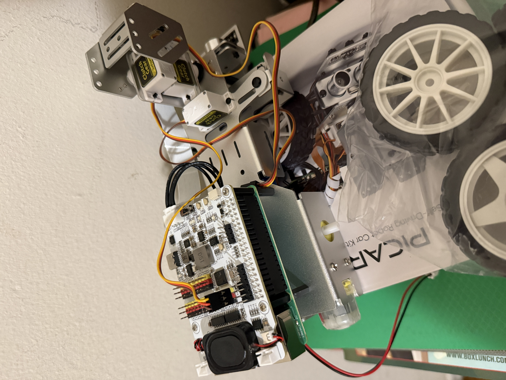
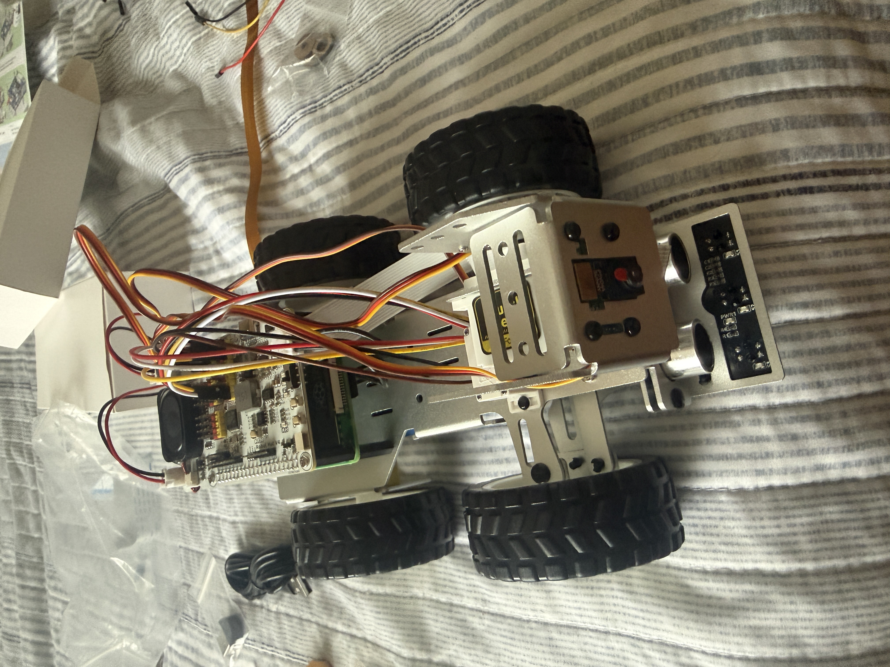
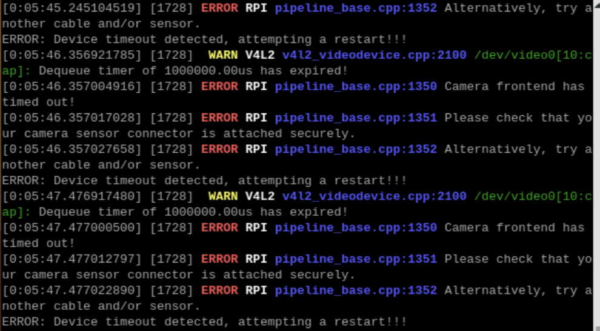

# AutonomousRobot
Building and adding autonomy to the PICAR-X SunFounder

## 1-5-26: Assembling the Robot Day 1
Currently building the robot. Some ideas for what to do with it:
- Path-finding with black tape
- Using camera to display Bluetooth feedback to the computer
Main idea of the robot is to integrate the relationship between software/hardware, while adding some unique features to the robot

Progress on Robot:

## 1-6-26: Assembling the Robot Day 2
Finished assembling the robot. Adding Raspberry OS to Raspberry Pi.

Trying to connect to Raspberry Pi through SSH -> not working. I suspect it may be something with the internet on the Raspberry Pi
- I am stupid -> was using the wrong username

Was able to connect via SSH. Able to set up VNC Viewer to get a graphical interface

Progress on Robot:

## 1-7-26: Software Setup
- Connected the robot directly to my router for a better connection. Will try and set up the internet on the Raspberry Pi so that I don't need the ethernet cable.
- Done setting up necessary software and connected Raspberry Pi to Internet
- Camera is not working for the robot, need to debug it

## 1-8-26: Camera Debugging
- The camera is not working as intended. 
- Ensured that all connections with FFC cable are properly set up.
- Ran rpicam-hello, the camera did not work and I got this error:

- Sent an email to SunFounder, waiting for response
- For now, brainstorming ideas for the robot, will only stick to one for the month of Jan/Feb

### Issues that I want to solve
- Don't have someone recording me, don't want to bother anyone. Can have the robot follow me around recording me
- Losing items, can have the robot track down a missing item underneath the bed, play a sound if it finds it
- Once I get the camera working, can have something to do with facial recognition

- Have the robot follow me around, avoid obstacles, make sure it doesn't bump into anything

How to get the robot to follow you around:
- Maybe wearing something that indicates that you need to follow it around
- Facial recognition, having it follow you around

## 1-9-26: Idea I Want to Do
Want to do a robot dog that follows commands. 

### Basic Functionality
- Can follow you around
- Avoids obstacles
- Uses the camera and computer vision to detect different hand positions.
- Follow Gesture: Robot follows you 
- Stop Gesture: Robot stops following you
- Spin Gesture: Robot goes around in a circle

## 1-10-26: Thinking about Voice Commands
- Working with SunFounder team to debug 

- Now working on dog
- Made a command that allows the dog to spin around
- Thinking about adding voice synthesis to have the dog follow voice commands as well (especially since camera is not working)

- Figured out voice commands on the robot, can now say spin and have the robot spin around
- There is also a physical keyboard command that can activate the spin as well
- Voice controls are blocking, so the keyboard commands and voice commands can't work together for now

<video width="320" height="240" controls>
  <source src="IMG_8244.mov" type="video/mov">
</video>
